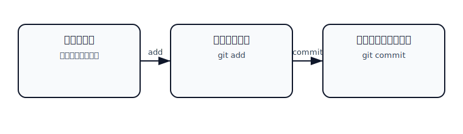
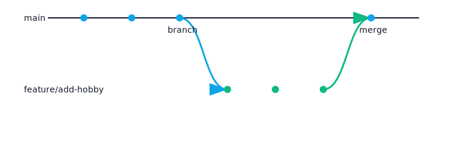
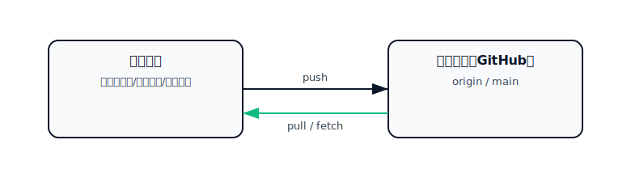
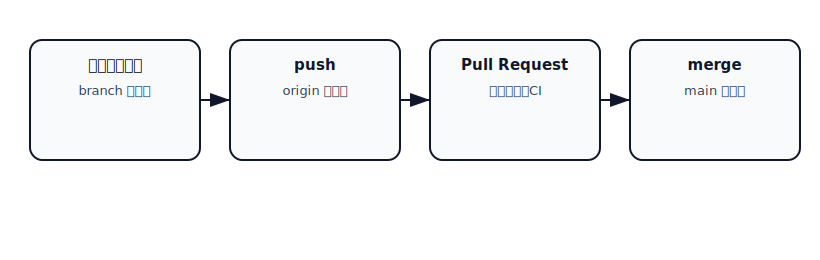

## 初心者向け Git/GitHub 講習会（教材）

対象: PC・プログラミング歴 約半年 / 目的: チーム開発に必要な Git の基礎を体験する

所要時間の目安: 120〜180分（進行に合わせて調整可）

---

### 0. 事前準備（5分）
- 参加者は各自の PC に Git をインストール済みであること（未インストールの場合はインストール案内）。
- シェルは Windows の場合 PowerShell を使用します（本資料のコマンドは PowerShell 想定）。

確認:

```powershell
git --version
```

例: `git version 2.45.1.windows.1`

初期設定（はじめての方）:

```powershell
git config --global user.name "あなたの名前"
git config --global user.email "あなたのメール@example.com"
git config --global init.defaultBranch main
```

---

### 1. イントロダクション（10分）
- 今日のゴール: Git の基本（add/commit/branch/merge/push/pull）と GitHub を使ったコラボの流れを体験する。
- キーワード: バージョン管理、履歴、ブランチ、リモート、プルリクエスト。

Git は「変更のセーブポイント」を作る道具、GitHub はその履歴を共有する場所です。



---

### 2. Git の基本（個人で触ってみる）（35分）

学ぶことの小さな契約:
- 入力: ファイルの作成/編集。
- 出力: コミット履歴（セーブポイント）。
- 成功条件: `git status` がクリーン、`git log` に自分のコミットが並ぶ。

手順:
1) 学習用フォルダを用意（例: デスクトップに `git-lesson`）

```powershell
cd "$env:USERPROFILE\Desktop"; mkdir git-lesson -Force; cd git-lesson
```

2) Git 管理を開始

```powershell
git init
git status
```

3) ファイルを作って add → commit

```powershell
"はじめまして。〇〇です。" | Out-File -Encoding UTF8 profile.txt
git add profile.txt
git commit -m "Add profile.txt (自己紹介)"
```

4) 変更してもう一度セーブ

```powershell
Add-Content -Encoding UTF8 profile.txt "\n趣味: 映画 / 音楽 / ゲーム"
git status
git add profile.txt
git commit -m "Add hobbies to profile"
```

5) 履歴を見る

```powershell
git log --oneline --graph
```

ポイント:
- `git add` は「セーブ候補（ステージ）」に載せる。
- `git commit` は「セーブ確定」。
- 迷ったら `git status`。

---

### 3. ブランチで作業を分岐（25分）

ブランチとは: セーブデータの分岐。元の `main` を壊さずに試せる。



演習:
1) 新しいブランチを切る → 切り替える

```powershell
git branch feature/add-hobby
git checkout feature/add-hobby
```

2) 変更してコミット

```powershell
Add-Content -Encoding UTF8 profile.txt "\n好きな言語: Python"
git add profile.txt
git commit -m "Add favorite language"
```

3) `main` に戻って差分を確認

```powershell
git checkout main
git diff main..feature/add-hobby -- profile.txt
```

4) マージ（分岐の変更を main に取り込む）

```powershell
git merge feature/add-hobby
```

補足: 近年は `git switch`/`git restore` も利用可能です（本講では `checkout` を使用）。

---

### 4. GitHub で共同作業（40分）

概念図:



手順:
1) GitHub に空のリポジトリを作成（例: `git-lesson`）

2) リモートの登録と初回 push

```powershell
git remote add origin https://github.com/<your-account>/git-lesson.git
git branch -M main
git push -u origin main
```

3) 別 PC/メンバーは clone して作業

```powershell
cd "$env:USERPROFILE\Desktop"; git clone https://github.com/<your-account>/git-lesson.git
cd git-lesson
git log --oneline --graph --decorate --all
```

4) 変更 → ブランチ → push → Pull Request を作成

```powershell
git checkout -b feature/add-name-<your-id>
Add-Content -Encoding UTF8 members.txt "<your-name>"
git add members.txt
git commit -m "Add my name to members"
git push -u origin HEAD
```

5) GitHub 画面で Pull Request（PR）を作成 → レビュー → マージ

ヒント:
- PR タイトルは「何を、なぜ」を簡潔に。
- 小さく早く出すとレビューしやすい。

---

### 5. コンフリクト体験 & 解決（25分）

コンフリクト=同じ行を別々に変更して衝突した状態。Git は自動で決められないので人が解決します。


演習（2人以上）:
1) 代表が `members.txt` を main にコミット → push。
2) A さんは `feature/a`、B さんは `feature/b` を作って、同じ行を別の内容にしてコミット → push。
3) 先に PR をマージした後、もう一方が PR を更新するとコンフリクトが発生。
4) ローカルで解決する場合:

```powershell
git checkout feature/b
git pull --rebase origin main  # あるいは main をマージ
# ファイル中の <<<<<<<, =======, >>>>>>> を手で直す
git add members.txt
git rebase --continue          # マージの場合は git commit
git push -f                    # rebase 後は上書き push が必要
```

解決のコツ:
- まず「両方の変更点」を確認し、最適な最終形に編集。
- ビルド/テストや動作確認を行ったうえでコミット。

---

### 6. Pull Request の流れ（補足資料）

PR の基本: 「私の変更を main に入れてください」。レビュー・自動チェック・承認・マージで品質担保をします。



レビューポイント例:
- 目的に合っているか（要件/課題解決）。
- 変更が小さく読みやすいか（1 PR は小さく）。
- 命名・コメント・ドキュメントは適切か。
- セキュリティ・機密情報の露出がないか。

---

### 7. トラブルシュート（よくあるエラー）

- Your name and email not configured（コミット時）

```powershell
git config --global user.name "Your Name"
git config --global user.email "you@example.com"
```

- push で拒否（non-fast-forward）

```powershell
git pull --rebase origin main
git push
```

- ファイルが追跡されない/消したのに残る

```powershell
git status
git add -A      # 追加・削除をまとめてステージ
git commit -m "Stage adds/removes"
```

- 直前のコミットメッセージを直したい（未 push）

```powershell
git commit --amend -m "Better message"
```

---

### 8. まとめ（5分）
- 基本: add → commit → branch → merge → push/pull → PR。
- 迷ったら `git status`、履歴は `git log`。
- 小さくこまめにコミット/PR で安全に進めよう。

---

### 付録 A: 練習課題（任意）
- 課題1: `tips.md` を作り、Git のコマンドメモを 3 つ書いて PR。
- 課題2: `docs/` を作成し、`README.md` に目次を追記する PR。
- 課題3: 同じ行を変更してコンフリクト→解決→PR まで体験。

