難易度: ★☆☆☆☆ 入門レベル

# 1. はじめに

* この記事は MCC Git 講習会 2025 の資料です.
* MCC でチーム開発をするために必要なレベルまで Git の知識を身につけることを目標とします.
* この回では詳しい概念の説明は省略しています.
* とりあえず編集の足跡をつけて, それをみんなで共有することができれば OK です.

## 1.1. 環境構築

ここでは, GitHub のアカウント作成と, Fork のインストールを行います. すでに済んでる人はスキップして OK です.

### 1.1.1. GitHub アカウントの作成

アカウントを持っていない人は, 以下の URL からアカウントを作成してください. 持ってればここの項目はスキップして OK です.

[https://github.com/join](https://github.com/join)

メールアドレスは個人用が望ましいです. 大学メアドだと卒業時に使えなくなる可能性があります.

### 1.1.2. Fork のインストール

Fork という GUI クライアントをインストールします. 以下の URL からお使いの環境にあったインストーラをダウンロードしてインストールしてください. 無料で使えます.

[https://git-fork.com/](https://git-fork.com/)

### 1.1.3. Fork の初期設定

Fork を起動すると以下のような画面が表示されます. ここで Git の設定を行います. `User Name` の項目に GitHub のアカウント名, `Email` の項目に GitHub のダミーメールアドレスを入力します.

* User Name

SUGAWA の GitHub アカウント名は `sugawa197203` です. なので `User Name` の項目は `sugawa197203` に設定します.

* GitHub のダミーメールアドレス

`Email` の項目は GitHub のダミーのメールアドレスに設定します. なぜダミーメールアドレスを使うかは後ほど説明します.

自身の GitHub のダミーメールアドレスは, GitHub の Settings -> Emails から確認できます.

Settings は右上のプロフィールアイコン -> Settings で開けます.

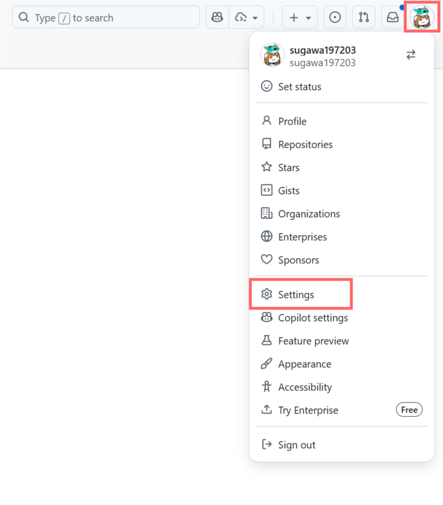

メールアドレスは Settings の左のメニューから Emails を選択すると, `Keep my email addresses private` の部分に `数字+アカウント名@users.noreply.github.com` という形式で表示されます.

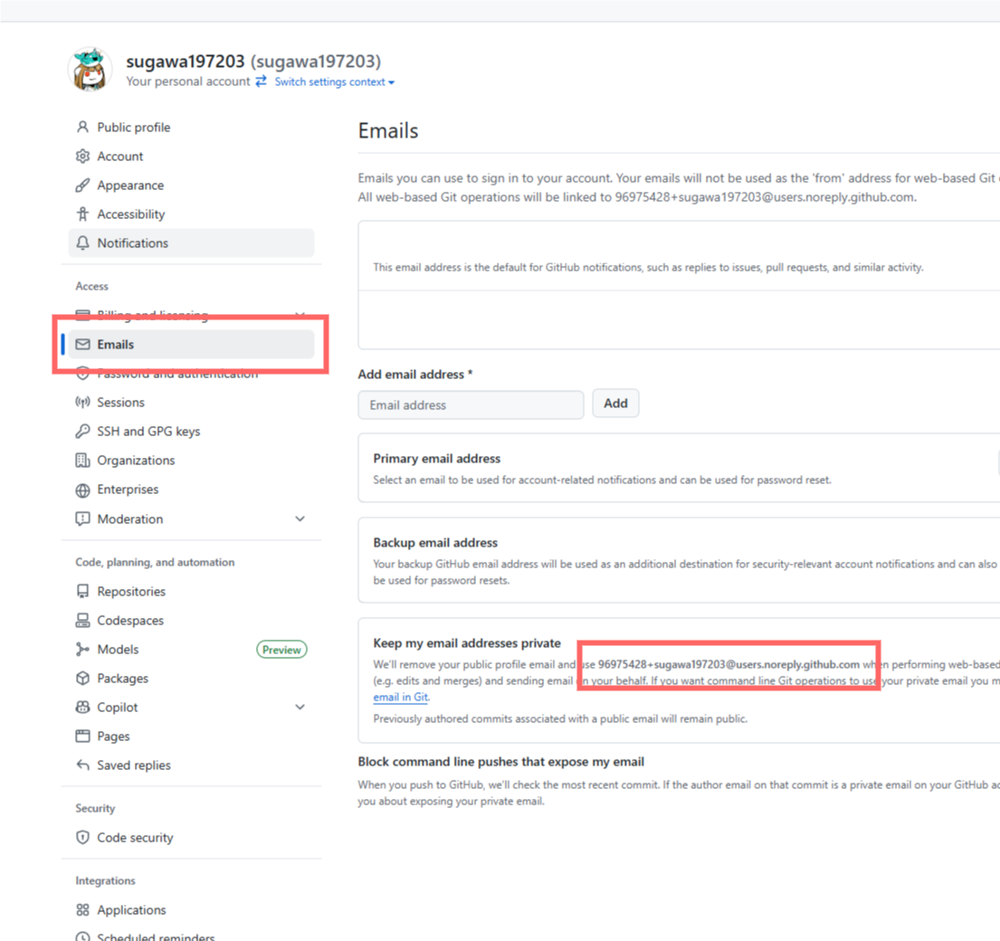

SUGAWA の場合は `96975428+sugawa197203@users.noreply.github.com` というメールアドレスが表示されているので, これを `Email` の項目に設定します.

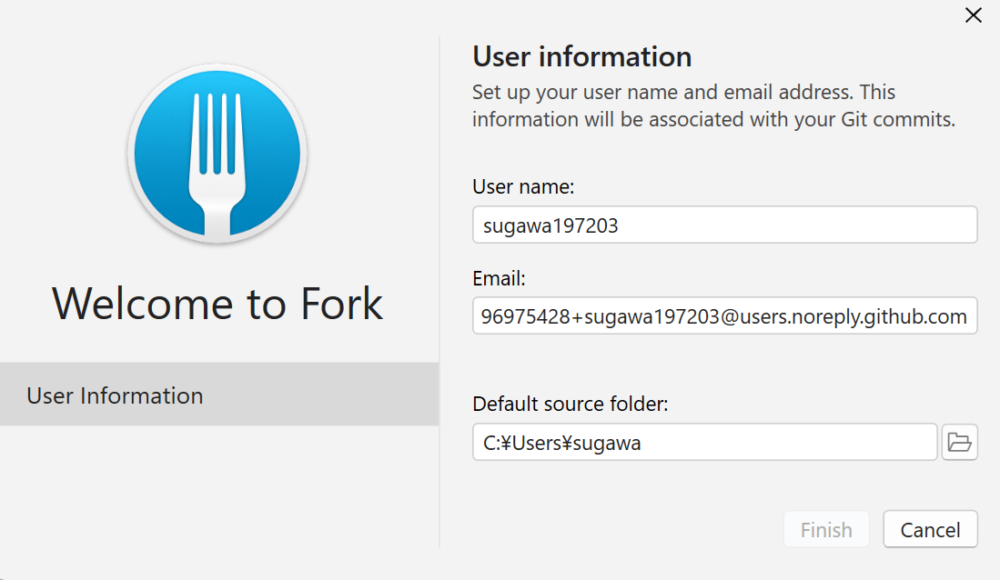

設定が終わったら `Finish` ボタンを押して設定を保存します.

続いて, GitHub のアカウントと Fork を連携させます. 左上の `File` -> `Accounts` を選択します.

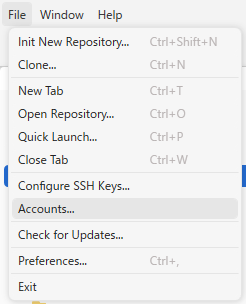

左下の `+` ボタンを押して, `GitHub.com` を選択して `Username` に GitHub のアカウント名を入力して `Login` ボタンを押します. ブラウザが起動して GitHub のログイン画面が表示されます.

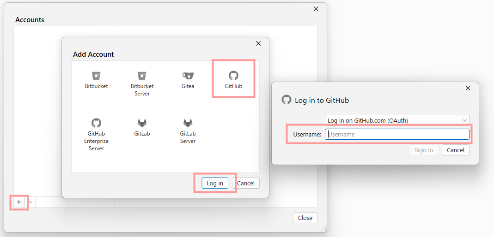

自分のアカウントが表示されれば OK です.

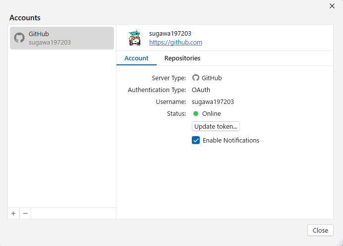

# 2. Git とは

Git とはバージョン管理システムの一つです.

バージョン管理システムとは, ファイルの変更履歴を管理するシステムのことで, "いつ", "誰が", "どこを", "何から何に変更したか(差分)" の履歴をコメントを付けて保存しておくことができます. Word や Excel にもバージョン管理機能があります. この機能を使うと, 変更履歴を確認したり, 過去のバージョンに戻したりすることができます. (やらかした人を炙り出せます)

# 3. リポジトリ

リポジトリとは, Git で管理されるプロジェクトの器だと思ってください. プロジェクトのファイルや変更履歴がすべてリポジトリに含まれます. エンジニア(作業者)はリポジトリの中でプログラムを編集したり, 変更履歴を保存したりします. 

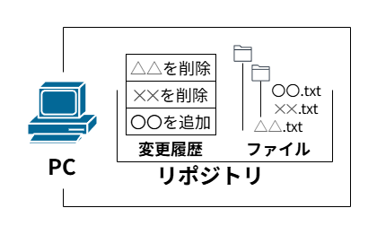

本講習会用のリポジトリが MCC の GitHub 上に用意しております. Github 上のリポジトリは, 作業者のローカル(自分の PC)に存在せず, サーバー上にあるので, リモートリポジトリと呼ばれます. MCC ではチーム開発をする際, リモートリポジトリを作成してから作業を始めます. 作業者は, リモートリポジトリを自分の PC にコピーしてから作業を始めます. そして, 作業が終わったら, 変更履歴(差分)をリモートリポジトリに反映させます. リモートリポジトリを自分の PC にコピーして, 自分の PC に現れたリポジトリのことをローカルリポジトリと呼びます.

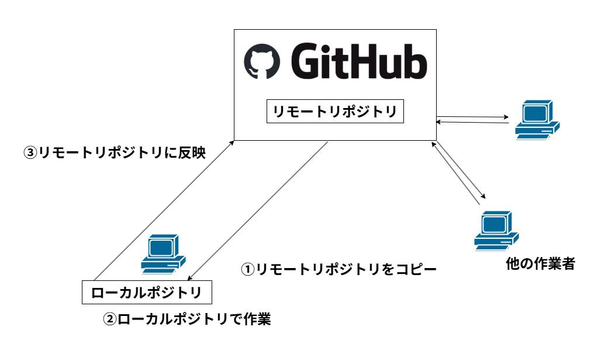

# 4. リポジトリのコピー (クローン)

作業者は, リモートリポジトリを自分の PC にコピーすることをクローンと呼びます.

先ほどの `Acount` の画面の `Repositories` タブを選択します. `tuatmcc` の項目の中の `GitLectureRepo` の右の ↓ ボタンを押して Clone してください.

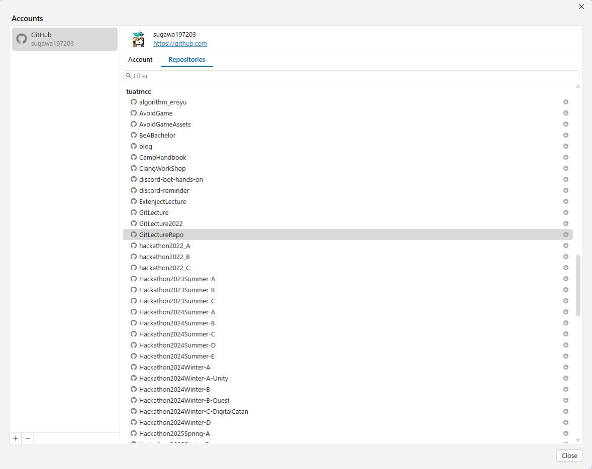

クローン先 (リモートリポジトリを置くフォルダ) を聞かれるので, 適当な場所を指定して `Clone` ボタンを押します. 特に気にしなければデフォルトで OK です.

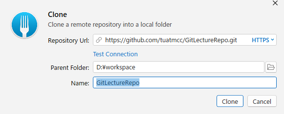

以下のように表示されれば OK です.

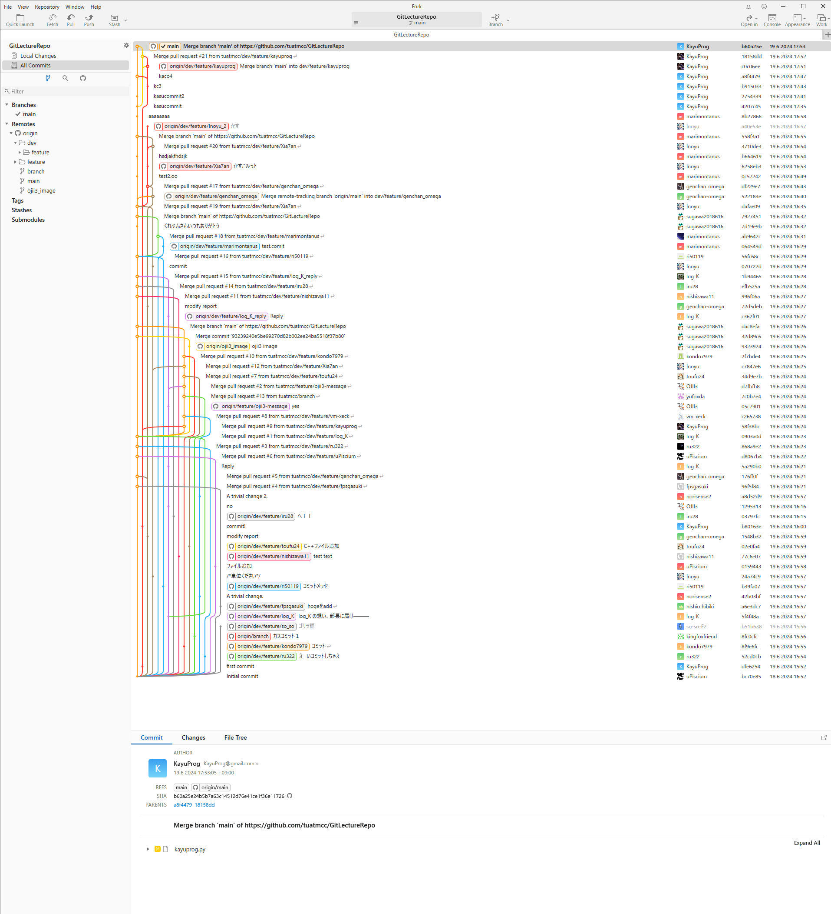

# 5. 編集履歴と時系列 (コミットとブランチ)

開発者はプロジェクトを編集したら, "いつ", "誰が", "どこを", "何から何に変更したか(差分)" の履歴をコメントを付けて保存します. これをコミットと呼びます. 以下の図は, コミットのイメージ図です. 変更履歴 (コミット) が時系列に並んでいます. 一番上が最新の変更履歴です. 

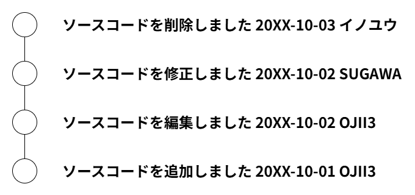

1 つの時系列にみんながコミットしたら以下のようになります (わかりやすくするために機能ごとに色分けしています). とてもゴチャゴチャしていますね. 以下の図では, 3 人の開発者がそれぞれ 3 つの機能を開発しています. これが数十人になったらとてもじゃないけど管理できません. 更に, `機能C` が完成したとき, `機能B` はまだ完成していません. なので, `機能C` をデバックしたいときに, `機能B` の未完成のコードが混ざっているため, `機能C` のデバックができない可能性もあります.

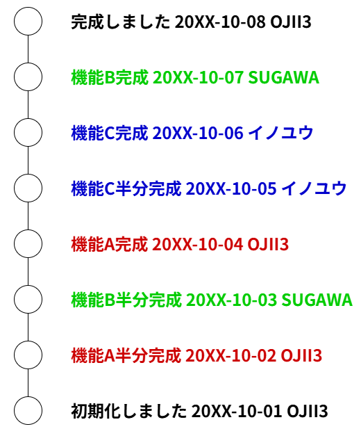

では, 時系列を分けたらどうでしょうか? 以下の図は, 機能ごとに時系列を分けたイメージ図です. これなら, `機能C` のデバックをしたいときに, `機能B` の未完成のコードが混ざることはありません. 機能が完成したら, メインの時系列に統合 (マージ) します. このように, 時系列は枝分かれして扱うのでブランチと呼びます. メインの時系列は, メインブランチ (main) と呼びます.

# 6. ローカルリポジトリでブランチ作成

先ほど皆さんにクローンしてもらったリポジトリを VSCode で開きます. VSCode の左上の `File` -> `Open Folder...` を選択して, クローンしたリポジトリのフォルダを選択します.

このリポジトリには皆さんに作業として, 1人1ファイルに自己紹介を書いてもらいます. はじめに自分の作業用のブランチを作成します. そして, そのブランチで自己紹介を書きます. 自己紹介が終わったら, 変更履歴をコメント付きで保存 (コミット) します. 最後に, 変更履歴をリモートリポジトリに反映させます (プッシュ). そして, 最後に, 皆さんの変更履歴を部長に確認 (レビュー) してもらい, 問題なければメインのブランチに統合 (マージ) します.

- 作業内容

1. 自分の作業用のブランチを作成する
2. 自己紹介を書く
3. 変更履歴をコメント付きで保存 (コミット)
4. 変更履歴をリモートリポジトリに反映させる (プッシュ)
5. 部長に確認 (レビュー) してもらう
6. 問題なければメインのブランチに統合 (マージ)

## 6.1. 自分の作業用のブランチを作成する

現在のローカルリポジトリで開いているブランチを確認します. 画面左の Branches の部分でチェックマークが付いているブランチが現在開いているブランチです. おそらく `main` ブランチが開いていると思います.

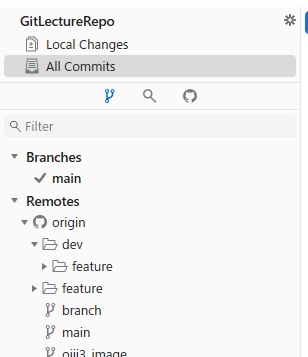
