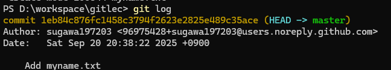

難易度: ★☆☆☆☆ 入門レベル

# 1. はじめに

* この記事は MCC Git 講習会 2025 の資料です.
* 入門編では Git ？ なんにそれおいしいの？って人や Git と Github の違いがわからない人の Git の知識を 0 から 1 にするための講習会です.
* コマンドはできる限りコピペではなく手打ちすることをおすすめします.

## 1.1. 環境構築

ここでは, git のインストールと, GitHub のアカウント作成と, git の初期設定を行います.

### 1.1.1. git のインストール

* Windows の場合

winget でインストールをします.

Windowsキーを押して `wt` と入力して Windows Terminal を起動し, 以下のコマンドを実行します.

```powershell
winget install --id Git.Git -e --source winget
``` 

* Mac の場合

TODO: 誰か詳しく書いて

Homebrew でインストールをします.

```bash
brew install git
```

* その他

自力で頑張ってください.

### 1.1.2. GitHub アカウントの作成

アカウントを持っていない人は, 以下の URL からアカウントを作成してください. 持ってればここの項目はスキップして OK です.

https://github.com/join

メールアドレスは個人用が望ましいです. 大学メアドだと卒業時に使えなくなる可能性があります.

### 1.1.3. git の初期設定

git の初期設定を行います. `user.name` の項目に GitHub のアカウント名, `user.email` の項目に GitHub のメールアドレス, `core.editor` の項目にエディタの設定を行います. 以下にそれぞれの 3 つのコマンド例を示します.

```powershell
git config --global user.name "Your Name"
git config --global user.email "you@example.com"
git config --global core.editor "code --wait"
```

* GitHub のアカウント名

SUGAWA の GitHub アカウント名は `sugawa197203` です. なので `user.name` の項目は `sugawa197203` に設定します.

```powershell
git config --global user.name "sugawa197203"
```

* GitHub のダミーメールアドレス

`user.email` の項目は GitHub のダミーのメールアドレスに設定します. なぜダミーメールアドレスを使うかは後ほど説明します.

自身の GitHub のダミーメールアドレスは, GitHub の Settings -> Emails から確認できます.

Settings は右上のプロフィールアイコン -> Settings で開けます.


メールアドレスは Settings の左のメニューから Emails を選択すると, `Keep my email addresses private` の部分に `数字+アカウント名@users.noreply.github.com` という形式で表示されます.


SUGAWA の場合は `96975428+sugawa197203@users.noreply.github.com` というメールアドレスが表示されているので, これを `user.email` の項目に設定します.

```powershell
git config --global user.email "96975428+sugawa197203@users.noreply.github.com"
```

* エディタの設定

エディタの設定は気にしなければ以下のコマンドで OK です. `code` は Visual Studio Code のコマンドです.

```powershell
git config --global core.editor "code --wait"
```

これで git の環境構築は完了です.

## 1.2. グラフについて

git について学ぶ前に, グラフについて軽く学びます. ここで言うグラフとは, 頂点と辺からなるデータ構造のことです. 棒グラフや折れ線グラフのようなグラフではありません. グラフには無向辺グラフと有向辺グラフの 2 種類があります.

### 1.2.1. 無向辺グラフ

以下に無向辺グラフの例を示します. 以下のグラフは 9 つの頂点がいくつかの辺でつながっています. 無向辺とは, 頂点 A から頂点 B に行くこともできるし, 頂点 B から頂点 A に行くこともできる辺のことです. 現実世界では, 鉄道網が無向辺グラフであることがイメージできると思います.


### 1.2.2. 有向辺グラフ

以下に有向辺グラフの例を示します. 以下のグラフは 9 つの頂点がいくつかの辺でつながっています. 有向辺とは, 頂点 A から頂点 B に行くことはできるけど, 頂点 B から頂点 A に行くことはできない辺のことです. 一方通行の道路が有向辺グラフであることがイメージできると思います.


### 1.2.3. 巡回

グラフには巡回という概念があります. 巡回とは, ある頂点から出発して, 辺をたどりながら他の頂点を通り, 最終的に出発した頂点に戻ってくることです. 上記のグラフでは, 頂点 2, 3, 4 を巡回することができます. 巡回が存在しないグラフのことはを非巡回グラフといいます.

# 2. Git の基本概念

Git は **分散型バージョン管理システム (Version Control System (VCS))** の 1 種です. ここでは, Git の基本概念について学びます.

## 2.1. バージョン管理システム

バージョン管理システムとは, ファイルの変更履歴を管理するシステムのことで, "いつ", "誰が", "どこを", "何から何に変更したか(差分)" の履歴をコメントを付けて保存しておくことができます. Word や Excel にもバージョン管理機能があります. この機能を使うと, 変更履歴を確認したり, 過去のバージョンに戻したりすることができます. (やらかした人を炙り出せます)

以下にバージョン管理システムのイメージを示します. 変更情報は有効非巡回グラフで表され, 頂点には変更情報が, 辺には変更の親(変更前の状態)を指します. 以下の図では一番左の頂点が最初の変更情報で, 右に行くほど新しい変更情報になります.


## 2.2. 中央集中型バージョン管理システム

中央集中型バージョン管理システムとは, 変更情報を中央のサーバーで一元管理するバージョン管理システムのことです. 中央集中型バージョン管理システムでは, 変更情報は中央のサーバーに保存され, ユーザーはサーバーから最新の変更情報を取得したり, サーバーに変更情報を保存したりします.

以下に中央集中型バージョン管理システムのイメージを示します.


## 2.3. 分散型バージョン管理システム

分散型バージョン管理システムとは, 変更情報を各ユーザーのローカル環境で管理できたり, サーバーも複数存在できるバージョン管理システムのことです. Git は分散型バージョン管理システムの 1 つです. 分散型バージョン管理システムでは, 変更情報は各ユーザーのローカル環境に保存され, ユーザーはローカル環境で変更情報を管理します. 変更情報を共有する場合は, サーバーを変更して情報を共有します.

以下に分散型バージョン管理システムのイメージを示します.


分散型バージョン管理システムを使う際, よくサーバーは 1 つだけしか使わないことが多いです. 本講習会では, このようにサーバーが 1 つだけの分散型バージョン管理システムを使うことを想定しています.

<!-- 詳しくは発展編でやる -->

# 3. Git リポジトリと初期化

ここでは, Git リポジトリと初期化について学びます.

## 3.1. リポジトリ

リポジトリとは, 変更情報を保存する場所のことです. VCS のグラフひとつ分だと思ってください. プロジェクトを VCS で管理する場合, プロジェクトごとにリポジトリを作成します(複数リポジトリを作るときもある).

## 3.2. リポジトリの初期化

ここからコマンドを使っていきます. 資料では Windows 環境ですが, 他の環境の人は適宜読み替えてください.

Windows キーを押しながら E キーを押してエクスプローラーを起動し(MacならFinder), 適当な場所にディレクトリを作成します. 以下の例では `gitlec` というディレクトリを作成しています. そして, 作成したディレクトリを右クリックし, `ターミナルで開く` をクリックして Windows Terminal を起動します. カレントディレクトリが作成したディレクトリになっていることを確認してください. 以下の画像では `D:\workspace\gitlec` になっています.


以下のコマンドを実行して, Git リポジトリを初期化します.

```powershell
git init
```


エクスプローラー(Finder)で先ほど作成したディレクトリを開くと, `.git` という隠しフォルダが作成されていることがわかります. これで Git リポジトリの初期化は完了です. 見えない人は, `表示` → `表示` → `隠しファイル` にチェックを入れてください.


## 3.3. .git

`.git` フォルダには, Git リポジトリの情報が保存されています. なので, `.git` フォルダをいじるとリポジトリが壊れる可能性があります. なので, `.git` フォルダの中身を直接いじることは基本的にありません(むしろいじらないでください).

<!-- 詳しくは発展編でやる -->

# 4. コミット

ここでは, Git の基本操作であるステージングとコミットについて学びます.

## 4.1. ファイル作成

リポジトリの中に `myname.txt` という名前のテキストファイルを作成し, 任意のテキストエディタで自分の名前を書いて保存してください. 


## 4.2. ファイルの状態

Git では, ファイルには 3 つの状態があります. 未追跡 (untracked), 変更あり (modified), 追跡済み (staged) です. 先ほど作成した `myname.txt` の状態を確認してみましょう. 以下のコマンドを実行します.

```powershell
git status
```


`Untracked files` の一覧に赤字で `myname.txt` が表示されていることがわかります. これは, `myname.txt` が未追跡の状態であることを意味します. 未追跡の状態とは, Git がファイルの存在を管理していない状態のことです. 新しく作成したファイルは, すべて未追跡の状態になります.

## 4.3. ステージング

ステージングとは, Git にファイルの変更を記録する準備をすることです. ステージングを行うには, `git add` コマンドを使用します. 以下のコマンドを実行して, `myname.txt` をステージングします.

```powershell
git add myname.txt
```

ステージングを行うと, `myname.txt` の状態が追跡済みになります. ステージングを行った後に, `git status` コマンドを実行して, `myname.txt` の状態を確認してみましょう.

```powershell
git status
```

`myname.txt` が `Changes to be committed` の一覧に緑字で表示されていることがわかります. これは, `myname.txt` が追跡済みの状態であることを意味します. 追跡済みの状態とは, Git がファイルの存在を管理している状態のことです. ステージングを行ったファイルは, すべて追跡済みの状態になります.


## 4.4. コミット

コミットとは, ステージングされたファイルの変更をリポジトリに保存することです. コミットを行うには, `git commit` コマンドを使用します. 以下のコマンドを実行して, `myname.txt` の変更をコミットします.

```powershell
git commit
```

エディタが起動するので, コミットメッセージを入力して保存して終了します. ここでは, `Add myname.txt` と入力します.


コミットメッセージを保存して終了すると, コミットが完了します. ターミナルには以下のように表示されます.


## 4.5. コミットの確認

コミットの履歴(ログ)を確認するには, `git log` コマンドを使用します. 以下のコマンドを実行して, 先ほどのコミットログを確認します.

```powershell
git log
```



コミットログを確認すると, コミットハッシュ, 制作者, 日時, コミットメッセージが確認できます. コミットハッシュとは, コミットを一意に識別するためのハッシュ値で, 16 進数で表されます. コミットハッシュは, コミットを参照する際に使用します. ハッシュ値についての詳しい説明は省略します. とりあえず, コミット 1 つにつき, ユニークなハッシュ値が割り当てられると覚えておいてください. (HEAD -> master) の部分は後で説明します.

<!-- 詳しくは発展編でやる -->

## 4.6. 既存のファイルの変更

`myname.txt` に自分の学籍番号を書き加えて保存してください. そして, `git status` コマンドを実行して, `myname.txt` の状態を確認してみましょう.

```powershell
git status
```


`Changes not staged for commit` の一覧に赤字で `modified: myname.txt` が表示されていることがわかります. これは, `myname.txt` が変更ありの状態であることを意味します. 変更ありの状態とは, Git がファイルの存在を管理しているが, ファイルの内容が変更されている状態のことです. 既存のファイルを変更すると, そのファイルは変更ありの状態になります.

変更ありの状態のファイルをステージングして, 変更をコミットしてみましょう. 以下のコマンドを実行して, `myname.txt` をステージングします.

```powershell
git add myname.txt
git commit -m "学籍番号を追加"
```

`-m` オプションを使用すると, コミットメッセージをコマンドラインで直接指定できます. これで, `myname.txt` の変更がコミットされました. `git log` コマンドを実行して, コミットログを確認してみましょう.

```powershell
git log
```


前のコミットの上に, 新しいコミットが追加されていることがわかります. Git のグラフに表すと以下のような感じです.


## 4.7. diff

続いて, `myname.txt` の名前と学籍番号の間に学科名を書き加えて保存してください. 以下のようになるはずです.

```
SUGAWA
知能情報システム工学
25540000
```

ここで, `git diff` コマンドを実行してみましょう. diff とは, 変更された部分を表示するコマンドです. 以下のコマンドを実行します.

```powershell
git diff
```

`myname.txt` の変更された部分が表示されます. 変更された部分は, `-` で始まる行が削除された部分, `+` で始まる行が追加された部分です. ここでは, 学科名の行が追加されたことがわかります.


確認できたらコミットしましょう. 以下のコマンドでコミットします.

```powershell
git commit -a -m "学科名を追加"
```

`-a` オプションを使用すると, 変更ありのファイルをすべてステージングしてからコミットします. わざわざ `git add` コマンドを実行しなくてもよくなるので便利です. ただし, 新しく作成したファイルはステージングされないので注意してください. コミットしたら, `git log` コマンドを実行して, コミットログを確認してみましょう.

```powershell
git log
```


増えました. Git のグラフに表すと以下のような感じです.


# 5. チェックアウトとブランチ

ここでは, チェックアウトとブランチについて学びます.

## 5.1. チェックアウトと HEAD

## 5.2. ブランチ

